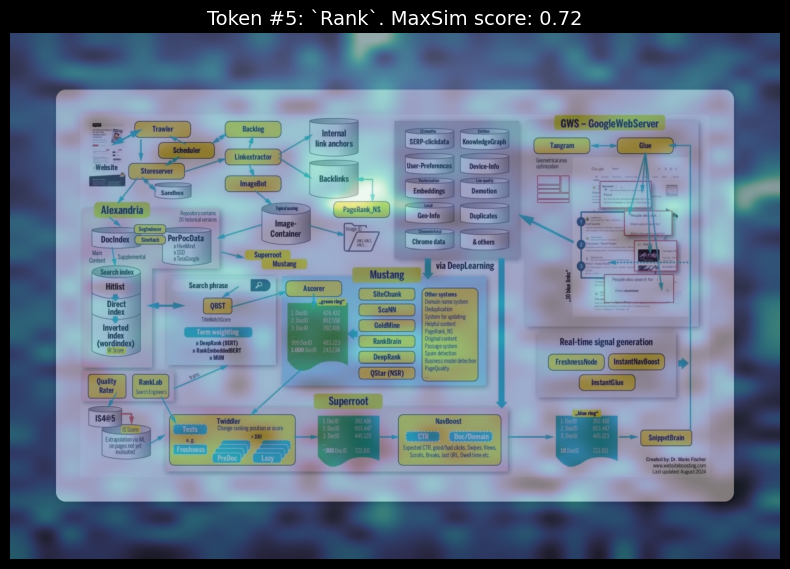

# VLM API

## About

REST API for computing cross-modal similarity between images and text using the [ColPaLI](https://huggingface.co/vidore/colpali-v1.2) vision-language model (read more [here](https://huggingface.co/blog/manu/colpali)). Provides token-level attention visualization and similarity scoring.

Interested in managed options? Get in touch with us at hi@datafog.ai. 

## Overview
**ColPali** is a **vision-language model** developed to improve document retrieval, specifically for documents with rich visual elements. Traditional retrieval models often struggle with complex layouts that combine text, images, and tables, as they primarily rely on text embeddings. ColPali, however, uses images of document pages instead of extracting text, enabling it to "see" visual information directly.

### How It Works
1. **Page Embeddings:** Each document page is represented as an image and divided into patches. These patches are fed into a vision transformer and later projected into a language model to generate embeddings.
2. **Multi-Vector Retrieval with Late Interaction:** Instead of matching a query to the document at a simple text level, ColPali allows for a richer comparison by matching each query term to specific document patches, then aggregating scores for better results.


#### Example
Uploading the image below and querying "Find PageRank", you can see the attention map and similarity score for the word chunk "Rank" in the document:


## Core Features

- **Cross-Modal Similarity Analysis**: Computes attention-based similarity scores between image regions and text tokens
- **Token-Level Granularity**: Breaks down similarity analysis per token, enabling fine-grained understanding
- **Attention Visualization**: Generates heatmaps showing which image regions correspond to specific text tokens
- **Quantitative Metrics**: Returns max/avg similarity scores and top-K attention hotspots per token

## Getting Started

*Note*: You will need a [Hugging Face API token](https://huggingface.co/settings/tokens) to access the ColPaLI model.  You can accept the conditions as a logged-in user from accepting the conditions on the [PaliGemma-3b](https://huggingface.co/google/paligemma-3b-mix-448) model card. 

## API Endpoints

### POST /query/single
Computes similarity between image and text query.

```bash
curl -X POST http://localhost:8000/query/single \
-F "file=@image.jpg" \
-F "query=text query"
```

Response:
```json
{
    "query": "text query",
    "overall_similarity": 0.85,
    "tokens": {
        "token": {
            "token_idx": 0,
            "max_similarity_score": 0.85,
            "avg_similarity_score": 0.45,
            "hotspots": [
                {"x": 15, "y": 20, "score": 0.85},
                ...
            ]
        }
    }
}
```

### POST /query/single/heatmap
Generates attention visualization maps.

```bash
# Single token heatmap
curl -X POST http://localhost:8000/query/single/heatmap \
-F "file=@image.jpg" \
-F "query=text query" \
-F "token_idx=0" \
-o heatmap.png

# All tokens (returns ZIP with multiple heatmaps)
curl -X POST http://localhost:8000/query/single/heatmap \
-F "file=@image.jpg" \
-F "query=text query" \
-o heatmaps.zip
```

## Setup

```bash
docker build -t vlm-api .
docker run -p 8000:8000 --env-file .env vlm-api
```


### Pros
- **Better Visual Context:** Captures layout, images, and charts that typical text-only models miss.
- **Efficient Indexing:** Requires fewer pre-processing steps than standard OCR-based methods, which often have errors.
- **Improved Performance:** Outperforms traditional models on visually complex documents like infographics, charts, and tables.

### Cons
- **Computational Cost:** Using vision models can be resource-intensive, especially when handling large corpora.
- **Query Complexity:** For simpler, text-heavy documents, this approach might be overkill compared to standard retrieval methods.

ColPali thus shines in contexts where visual elements are key to understanding the document, making it a strong alternative to traditional retrieval-augmented generation approaches in such scenarios.

## Technical Details

- Model: ColPaLI v1.2 (vidore/colpali-v1.2)
- Precision: bfloat16 (requires macOS 14.0+ for Apple Silicon)
- Auto device selection (CPU/CUDA)
- CORS enabled
- Async request handling
- Automatic temp file cleanup